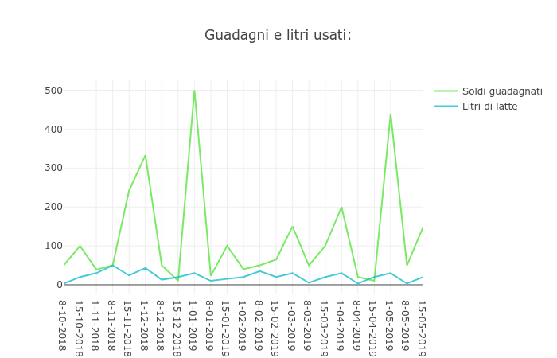

 

 

# For_my
A program I developed on my own for [Azienda Agricola Trentina](https://www.facebook.com/azagrtrentina) to manage the production of cheese, fully written with Python 3 and complies with the pep8 standard.

It stores data in a `.csv` file and can manage it, even generating graphics (using plotly).

## Instructions
- Make sure you have installed [`python3`](https://www.python.org/downloads/) and [`pip`](https://pip.pypa.io/en/stable/installing/).
- Install the dependencies using `pip install -r requirements.txt`
- Launch the script in the terminal using `python3 For_my.py`
- Choose the option using the corresponding number.

### License
See the [LICENSE](https://github.com/rob93c/RomRoamer/blob/master/LICENSE.md) file for license rights and limitations (MIT).