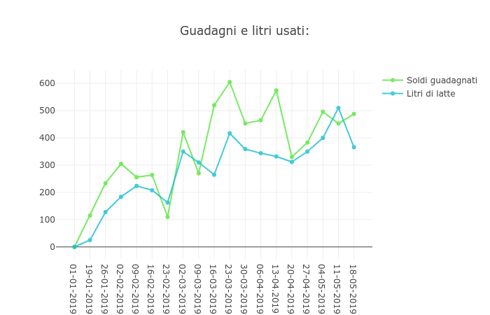

    

# For_my

A program I developed on my own for [**Azienda Agricola Trentina**](https://www.facebook.com/azagrtrentina) to manage the production of cheese, fully written with *Python 3* and _**PEP8 compliant**_.

It stores data in a `.csv` file and can manage it, generating a chart (using plotly).

## Instructions

- Make sure you have installed [`python`](https://www.python.org/downloads/) and [`pip`](https://pip.pypa.io/en/stable/installing/).
- Install the dependencies using `pip install -r requirements.txt`
- Launch the script in the terminal using `python For_my.py`
- Choose the option using the corresponding number.

### License

See the [**LICENSE**](https://github.com/rob93c/RomRoamer/blob/master/LICENSE.md) file for license rights and limitations (MIT).